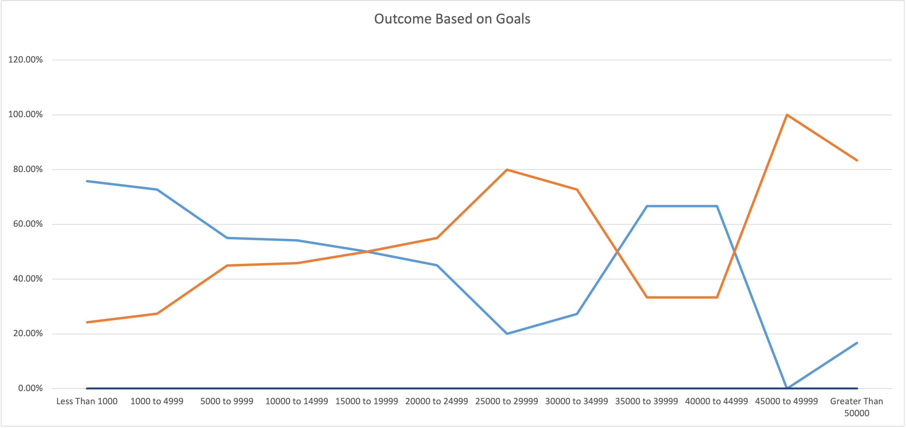
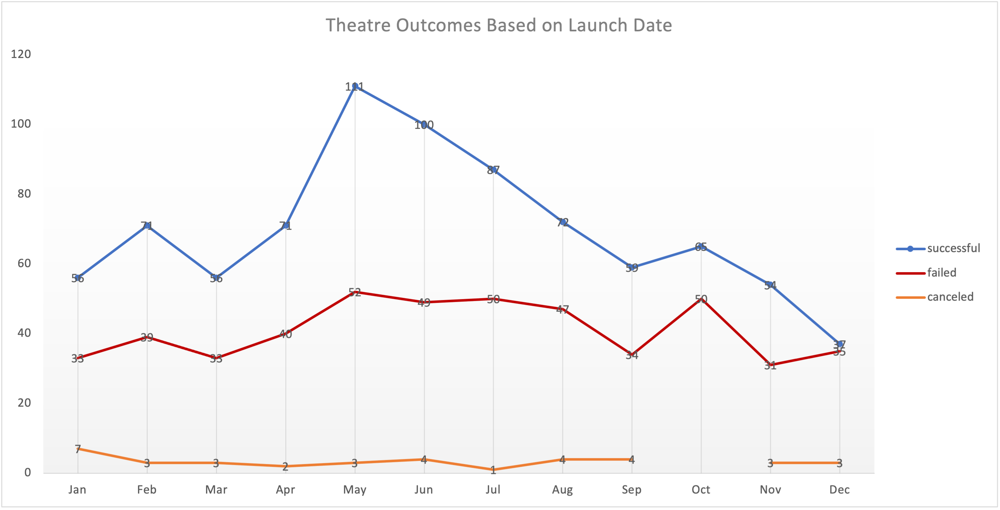

# Kickstarter_Challenge

## Overview of Project
This project is being used to identify two relationships. The first relationship we investigate is to show the relationship between *theatre's outcomes based on launch dates* and the second one is to show the relationship between *play outcomes based on goals.*

### Purpose
**This project will mainly highligh and bring out the key factors for the differences of the two investigations and how they fared in relation to their launch dates and their funding goals.**

## Analysis and Challenges
In this sections we will talk about the **analysis and challenges** faced when these individual experiments were conducted. 

Firstly here we will consider the what additional conversions and column additions were done to the ***Kickstarter*** excel file. So, we see that the *"launched_at"* column is supposed to be showing dates but has in under *Unix Based* time format. Therefore we created a ***"Date Created Conversion"*** column to show the actual date format and the seperated the years using the ***year*** function on excel. After the creation of these preceding columns we could see trend of theatre over a period of 9 years. A pivot table was created with main criteria being considered successful, failed and cancelled for theatre outcomes over the specific time period. In the end we created a line chart to bring this trend to a visualization perspective.

The second experiment and analysis was performed to derive the results onhow the *outcomes varied when placed against goals for plays.* We started of by taking several date ranges with diffrences of the amount 4999, starting from **"<1000"** ending to the being **">50000"**. We distributed the entire data set between twelve ranges and we found the specific values for successful, failed and cancelled filtering only for plays. Then we used the **total outcome** column for and along with the previous date calculated *Percentage successful, failed and cancelled".* We then used a line chart to visualize the data and show the possible trend.

Both trends and line charts are displayed in following pictures.

### Analysis of Outcomes Based on Launch Date

### Analysis of Outcomes Based on Goals

### Challenges and Difficulties Encountered
There were no specific or significant challenges experienced when these studies were conducted. the following mihgt be some reasons for deviations in the studies :
- The values found in **goals** column might significantly change the :
1. Mean
2. Standar deviation
3. Variance
4. Upper Quartile
5. Lower Quartile
6. Inter Quartile Range

Thus, causing an assymetrical distribution.
           
## Results
#### Here we will discuss and answer a set of questions that will help drill down conclusions on the over study that was performed.

1. What are two conclusions you can draw about the Outcomes based on Launch Date?
- For the fisrt study where we observed **Theatre Outcomes Based On Launch Dates"** we can observe that the percentage successfull attained was highest during the month of May. After May that trend in succees does start to deter. However, during the month of December the the gap between percentage succesful and failed is lower than that of May. Thereare no cancellations for plays in the given set.

2. What can you conclude about the Outcomes based on Goals?  

- For the second study where we compared **Outcomes Based On Goals** we can very clearly state that the highest level of  succes was retained for the plays which had a goal of the range between $1000 to $5000.

3. What are some limitations of this dataset?

- Now we will look at a list of limitations and  what we had to alter on the original data set:
  - Unix Timestamp format has to be converted to made readable to the people in question.
  - Both Category and Subcategory were listed under same column which required to be seperated.
  - Some values in data set will affect mean , skewing the data to the right.
  
4. What are some other possible tables and/or graphs that we could create?
- We could have done a few things differently :
  - We could have made other studies where we could have compared the outcomes to the years which would have given us a yearly trend as well.
  - We could have different diagram respresentation as histogram or pie chart
  - We could have used a box and whisker diagram as well to find potential outliers and also determine the siginificance of the studies respectfully.
  - Also , we could have compared percentage successful, failed and canceled in comparison to a parent category then a sub - category.
